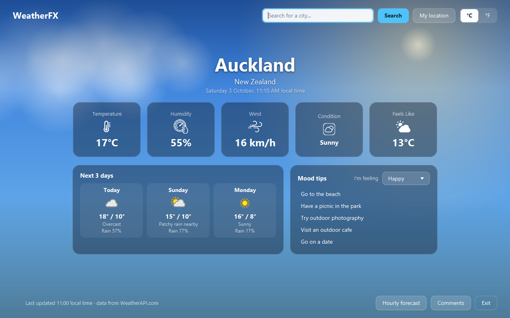
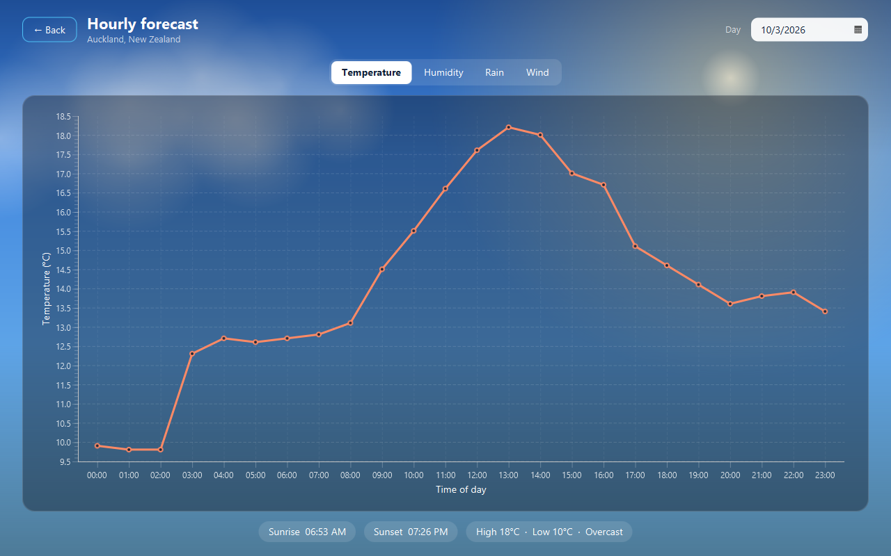
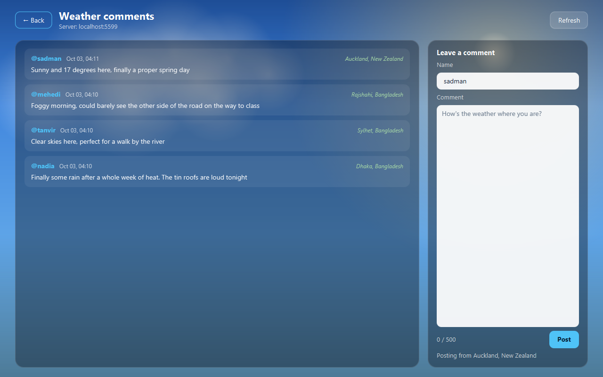
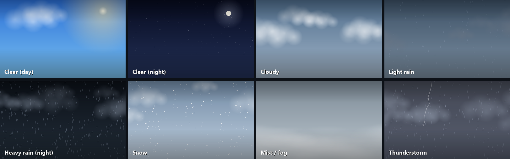

# WeatherFX

A desktop weather app I built with Java and JavaFX. Search for a city and the whole window changes with the weather: it rains when it's raining there, snows when it's snowing, and at night you get stars.



This started as my term project for **CSE 108**. It sat on my drive half-finished for a while, so I came back to it, finished the parts I'd left hanging, cleaned up the code and put it here. In collaboration with Sk. Arib Rajin Shahan

## What it does

- **Current weather** for any city: temperature, humidity, wind, condition and "feels like"
- **My location** button that figures out where you are from your IP address (no GPS needed)
- **Next 3 days** at a glance
- **Hourly forecast chart** for any day from a week ago up to two weeks ahead. Switch between temperature, humidity, chance of rain and wind, and hover over a point to see the exact value
- **Mood tips**: pick how you're feeling and it suggests something to do that suits the weather outside
- **Comments board**: a small client/server feature over plain Java sockets, so people on the same network can post what the weather is like where they are
- **°C / °F switch** (also flips km/h to mph), remembered between runs
- **Animated backgrounds** for clear skies, clouds, light rain, heavy rain, snow, fog and thunderstorms, with day and night versions



## Running it

You need **JDK 17 or newer** (for example [Temurin](https://adoptium.net/)). You don't need Maven installed, because the Maven wrapper (`mvnw`) is included. The first run downloads Maven and the libraries, so it needs internet and takes a minute or two.

**1. Get the code.** Clone the repo, or click **Code → Download ZIP** on GitHub and extract it. Open a terminal in the folder that has `pom.xml` in it.

**2. Get a free API key** from [weatherapi.com](https://www.weatherapi.com/signup.aspx). The free plan is plenty.

**3. Add the key.** Make a copy of the example config:

```bash
cp config.example.properties config.properties      # Windows: copy config.example.properties config.properties
```

then paste your key into `config.properties`:

```properties
weatherapi.key=your-key-here
```

`config.properties` is git-ignored, so the key never ends up on GitHub. If you prefer, you can set a `WEATHER_API_KEY` environment variable instead. The app looks for `config.properties` in the folder it's started from, so keep it next to `pom.xml`.

**4. Run it.** On macOS or Linux:

```bash
./mvnw javafx:run
```

On Windows (PowerShell, which is also the default terminal in VS Code):

```powershell
.\mvnw.cmd javafx:run
```

If macOS or Linux says `permission denied`, run `chmod +x mvnw` once and try again.

> On JDK 24 or newer you'll see a few `WARNING:` lines about `sun.misc.Unsafe` and native access at startup. They come from JavaFX 21 itself and don't affect anything.

### From VS Code

1. Install the **Extension Pack for Java** (by Microsoft).
2. **File → Open Folder** and pick the project folder, then wait for the Java import to finish (watch the status bar).
3. Run the command from step 4 in the built-in terminal, or open `Launcher.java` and click **Run** above `main`.

### From IntelliJ IDEA

1. **File → Open**, pick the project folder and open it as a project. IntelliJ sets it up as a Maven project on its own.
2. In **File → Project Structure → Project**, set the SDK to JDK 17 or newer.
3. Open `Launcher.java` and click the green run arrow next to `main`. Running **javafx:run** from the Maven tool window (Plugins → javafx) works too.

In either IDE, run `Launcher` rather than `WeatherApp`. Starting `WeatherApp` directly fails with "JavaFX runtime components are missing", and `Launcher` is there to get around that.

### Comments server

The comments screen talks to a small socket server. Start it in a second terminal:

```bash
./mvnw compile exec:java                       # listens on port 5555
./mvnw compile exec:java -Dexec.args="6000"    # or choose another port
```

On Windows (PowerShell):

```powershell
.\mvnw.cmd compile exec:java
.\mvnw.cmd compile exec:java "-Dexec.args=6000"
```

From VS Code or IntelliJ you can also just run the `main` method in `CommentsServer.java`.

Comments get saved to `comments.jsonl` in the folder you started it from. To share one board with friends on the same Wi-Fi, run the server on one machine and set `comments.host` in everyone's `config.properties` to that machine's local IP.

If the server isn't running, the rest of the app still works. The comments screen just tells you it can't connect.



## The backgrounds

The first version played looping video clips behind the UI. Video files are big and don't really belong in a git repo, so I rewrote the backgrounds to be drawn in code on a JavaFX `Canvas`. You get gradient skies, drifting clouds, rain slanting in the wind, swaying snowflakes, fog, twinkling stars and the occasional lightning strike.



The video support is still there. Drop `.mp4` files into `src/main/resources/com/weatherfx/videos/` (`Sunny.mp4`, `Heavy_Rain.mp4` and so on; the full list is in [that folder's README](src/main/resources/com/weatherfx/videos/README.md)) and the app plays those instead.

For the full story (how each effect is drawn, how to change it, making your own clips and adding a new kind of weather), see [additional/backgrounds.md](additional/backgrounds.md).

## How it's put together

```
src/main/java/com/weatherfx
├── WeatherApp.java        entry point, wires everything together
├── Launcher.java          plain main() so it runs from an IDE without extra setup
├── AppConfig.java         reads config.properties and env vars
├── api/                   WeatherAPI client and JSON parsing
├── model/                 records (Location, CurrentWeather, ForecastDay...), Sky, Units
├── mood/                  the mood-based suggestions
├── comments/              socket server, client and comment storage
└── ui/                    controllers, screen switching, the animated background

src/main/resources/com/weatherfx
├── views/                 FXML for the three screens
├── css/app.css            all the styling
├── icons/                 icons on the weather cards
└── videos/                optional background clips
```

A few things worth knowing if you're reading the code:

- **Network calls stay off the UI thread.** Every API and socket call runs in the background and hands its result back with `Platform.runLater`, so the window never freezes. If you search twice quickly, the older answer gets ignored.
- **One window, swapped screens.** The main screen is loaded once and kept around, so jumping to the forecast and back doesn't lose what you were looking at.
- **The comments protocol is simple on purpose.** It uses one short connection per request over `DataInputStream`/`DataOutputStream`, and each request is either `GET` or `POST`. The server handles clients with a thread pool and stores one JSON object per line, so a comment with line breaks in it can't corrupt the file.
- **From weather conditions to visuals.** WeatherAPI has around 50 condition texts ("Patchy light rain with thunder", "Freezing fog" and so on). `Sky.fromCondition` boils them down to 7 types, which drive both the background and the mood tips.

## Tests

```bash
./mvnw test          # Windows: .\mvnw.cmd test
```

The tests cover:
- JSON parsing, against real (trimmed) API responses
- the condition mapping and unit conversion
- the mood tips and config loading
- the comments server end to end, on a random port

## Ideas for later

- Air quality and weather alerts (the API supports both)
- A list of favourite cities
- A proper installer using `jpackage`

## Credits

- Weather data from [WeatherAPI.com](https://www.weatherapi.com/)
- Built with [JavaFX](https://openjfx.io/) and [Gson](https://github.com/google/gson)

## License

[MIT](LICENSE)
